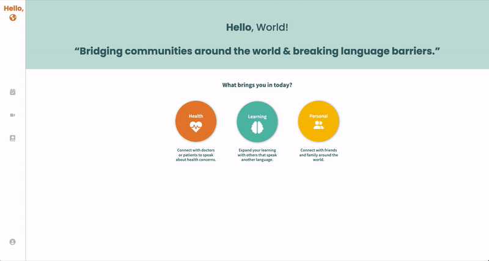

# Hello, World!

_Hello, World!_ is a single-page app where you can meet with others for a one-on-one video call with live captions translated for your co-participant in their preferred language.

This app is a multi-developer project built from start to finish and managed with Git throughout entire lifecycle.
  - Collaborators: [Karen](https://github.com/careuno), [Sameer](https://github.com/houseofsam), [Lorenço](https://github.com/ocnerol)

# Purpose

This app was originally designed to make digital health appointments more linguistically accessible. As such, only the 'Health' option on the homepage is functional. Nevertheless, we quickly learned the functionality of live translated captions could be useful in virtually any situation where users might meet over a video call. Thus, we decided to name the app with a title that reflect's its ability to help people communicate with anyone around the world.

##  Join A Call
1. Visit [the Hello, World! app](https://6217d70a7b34ae00b47f490c--gracious-fermat-d56c12.netlify.app/).
2. From the homepage, click on the 'Health' button. When the modal pops up, enter your name and preferred language in the appropriate fields. (You can ignore the 'Patient ID' field for now).
3. In the appointments view (automatically redirected once you submit the modal from step 2), click on any 'Join Call' button and you will be redirected to a call room.
4. Grant webcam and microphone permissions.
5. To have your speech translated live and transcribed and stored in the transcription log, click on the speech bubble button next to 'Transcription Log' under your video. 
6. Have another user follow steps 1-5 and start talking!

### Check back soon for new features!

# Media

### Walkthrough of typical user interaction from homepage to call room

## Dependencies

- Axios
- Classnames
- Express
- FontAwesome
- Material UI Core & Icons
- Normalize.css
- Jest
- React
- React-DOM
- React-Hook-Speech-To-Text
- React Router
- Socket.io
- Twilio Video